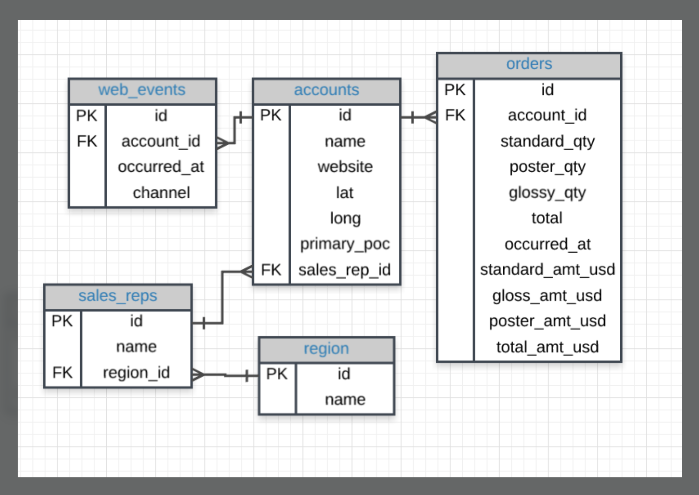

## Udacity -- SQL for Data Analysis

This repository houses the SQL files for exercises apart of the Udacity course, [SQL for Data Analysis](https://www.udacity.com/course/sql-for-data-analysis--ud198).

This course utilizes the [Parch and Posey database](https://video.udacity-data.com/topher/2020/May/5eb5533b_parch-and-posey/parch-and-posey.sql) created for the course itself. All of the lessons in this course utilize PostgreSQL environments. 

The schema for this database can be found below. 

